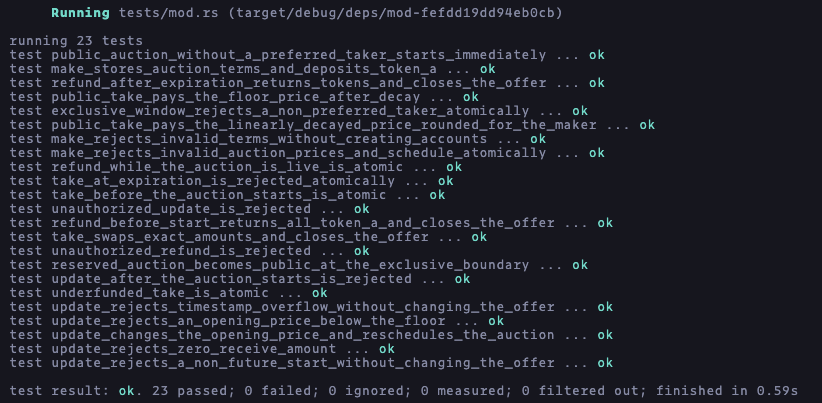

# Solana SPL Token Escrow

An Anchor program for exchanging two SPL tokens atomically through a Clock-based reserved Dutch auction on Solana.

## Overview

This project implements the complete escrow lifecycle:

- Maker creates a scheduled offer and deposits token A into a program-controlled vault
- Before it begins, the maker may update the opening price and reschedule the auction
- An optional preferred taker receives an exclusive acceptance window
- The offer becomes public and token B price decays to a configured floor
- A taker pays the current token B price and receives token A in the same transaction
- The maker can cancel before the auction starts or reclaim the tokens after expiration

The auction uses `Clock::get()?.unix_timestamp` for time-based logic.

## Design

Each offer uses an escrow PDA:

```text
["escrow", maker public key, seed]
```

| Account       | Authority  | Purpose                                                     |
| ------------- | ---------- | ----------------------------------------------------------- |
| `escrow`      | Program    | Stores the parties, mints, prices, schedule, seed, and bump |
| `vault`       | Escrow PDA | Holds token A deposited by the maker                        |
| `maker_ata_a` | Maker      | Supplies token A and receives it again following a refund   |
| `maker_ata_b` | Maker      | Receives token B when a taker accepts the offer             |
| `taker_ata_a` | Taker      | Receives token A when the offer is accepted                 |
| `taker_ata_b` | Taker      | Supplies the current token B price                          |

### Auction phases

| Time                                     | Behavior                                                 |
| ---------------------------------------- | -------------------------------------------------------- |
| Before `starts_at`                       | Taking is disabled; the maker may update or refund       |
| `starts_at <= now < exclusive_until`     | Only the preferred taker may accept at the opening price |
| `exclusive_until <= now < decay_ends_at` | The offer is public and the price decays linearly        |
| `decay_ends_at <= now < expiration`      | The offer is public at `minimum_receive`                 |
| `now >= expiration`                      | Taking is disabled; the maker may refund                 |

When `preferred_taker` is `None`, `exclusive_until` must equal `starts_at` → public auction starts immediately.

During decay phase, the token B price is:

```text
receive - floor(
  (receive - minimum_receive)
  * (now - exclusive_until)
  / (decay_ends_at - exclusive_until)
)
```

Price is rounded in the makers favor.

### Make arguments

`make` accepts `seed`, `deposit`, and a named `AuctionTerms` value:

| Argument or field       | Meaning                                                     |
| ----------------------- | ----------------------------------------------------------- |
| `seed`                  | Maker-selected value used in the escrow PDA                 |
| `deposit`               | Token A amount placed in the vault                          |
| `terms.receive`         | Opening token B price                                       |
| `terms.minimum_receive` | Lowest token B price                                        |
| `terms.preferred_taker` | Optional public key with access during the exclusive window |
| `terms.starts_at`       | Future Unix timestamp at which taking becomes possible      |
| `terms.exclusive_until` | End of the preferred window and start of public access      |
| `terms.decay_ends_at`   | Time at which the price reaches `minimum_receive`           |
| `terms.expiration`      | Time at which taking ends and refunding becomes possible    |

The prices must satisfy `0 < minimum_receive <= receive`. The timestamps must be ordered, and `starts_at` must be in the future when the offer is created.

### Updating an offer

`update(receive, starts_at)` is maker-only and may run only before the auction's current `starts_at`. The replacement opening time must be later than the current timestamp.

Changing `starts_at` shifts `exclusive_until`, `decay_ends_at`, and `expiration` forward in time to keep the original duration.

## Instructions

| Instruction | Purpose                                                                    |
| ----------- | -------------------------------------------------------------------------- |
| `make`      | Create a scheduled offer and transfer the maker's token A into the vault   |
| `update`    | Change the opening price and reschedule all phase boundaries before start  |
| `take`      | Enforce the current phase and price, execute the swap, and close the offer |
| `refund`    | Return token A before the start or after expiration and close the offer    |

## Token and rent flows

### Make

```text
maker_ata_a -- token A --> vault
```

The maker funds the escrow state and vault rent.

### Take

```text
taker_ata_b -- current token B price --> maker_ata_b
vault       -- all deposited token A --> taker_ata_a
```

The taker funds missing destination ATAs. The vault closes to the taker, while the escrow state closes to the maker.

### Refund

```text
vault -- all deposited token A --> maker_ata_a
```

The vault and escrow state both close to the maker. Refund is locked during a live auction so the maker cannot withdraw an advertised offer.

## Architecture diagrams

### Make

[Make instruction architecture](./arch/make.png)

### Take

[Take instruction architecture](./arch/take.png)

### Refund

[Refund instruction architecture](./arch/refund.png)

## Setup

Install Rust, Solana, and Anchor.

## Testing

Build the program and run the tests:

```bash
anchor build
anchor test --skip-local-validator --skip-deploy
```

The integration tests cover:

- auction terms, vault authority, and exact token A deposits
- Invalid token terms, ranges, schedules
- Maker-only updates, rescheduling, updated terms used by `take`
- Rejected past-time and invalid reschedules
- Preferred-taker only during the exclusive window
- Public auctions with and without preferred taker
- Linear price decay, rounding, min-price phase
- Before-start and expired take rejection
- Refunds before start and after expiration, live-auction lock
- token movements, account close, rent repayment



## Submission

### Task status

- [x] Implement `make`
- [x] Implement `take`
- [x] Implement `refund`
- [x] Implement `update`
- [x] Add LiteSVM coverage for all base instructions
- [x] Implement the optional Clock-based reserved Dutch auction
- [x] Add LiteSVM coverage for auction phases and boundary behavior
- [x] Capture the final passing-test screenshot
